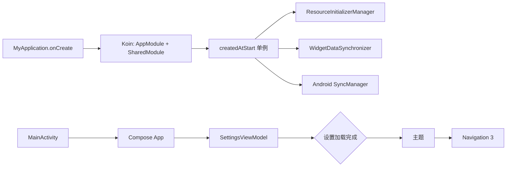
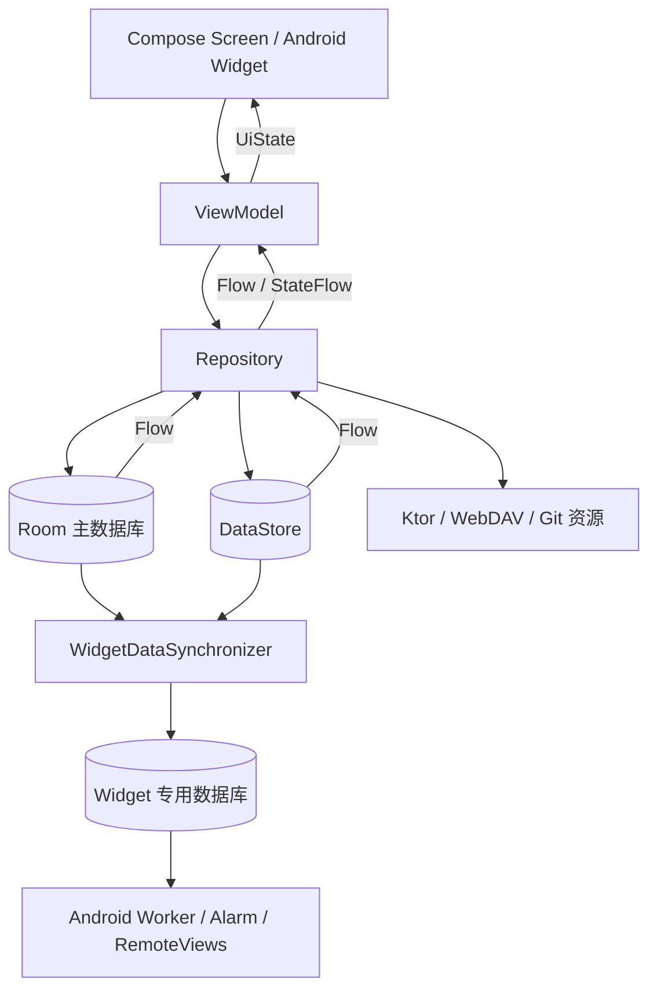
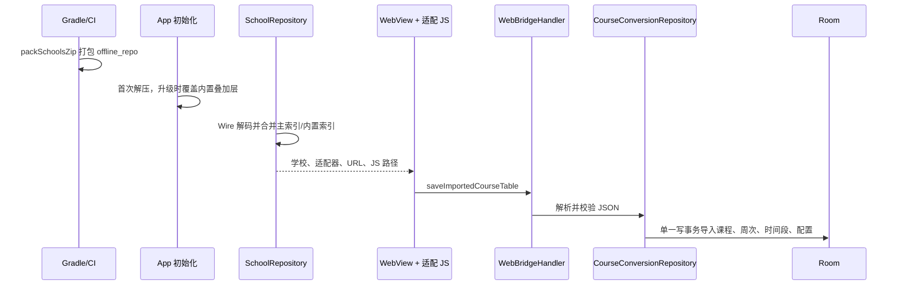

# 拾光课程表：项目原理与架构

本文基于当前仓库源码整理，目标是帮助开发者从“应用如何启动、数据如何流动、课表如何计算、平台能力如何落地”四个角度快速建立整体认识。

## 1. 项目定位与当前边界

拾光课程表是面向高校师生的课程表管理应用。核心能力包括多课表管理、按周/当天展示、教务系统脚本导入、JSON/ICS 导入导出、WebDAV 备份、Android 小组件、课程提醒和上课时勿扰/静音。

项目从 2.x 起采用 Kotlin Multiplatform 与 Compose Multiplatform：大部分 UI、业务、持久化与网络代码位于 `shared`，各端只实现入口和平台相关能力。

当前平台状态需要区分：

- Android 是 README 明确支持的交付平台，最低 Android 8.0（API 26）。
- Desktop 和 iOS 已有工程、入口、数据库及部分平台实现，属于适配中的骨架。
- Android 在 `MyApplication` 中启动 Koin；Desktop/iOS 入口会直接调用共享 `App()`，当前源码未见这两个入口对应的 Koin 初始化，因此不能把它们视为已完成、可直接运行的平台。

## 2. 模块划分

| 模块 | 职责 | 关键位置 |
| --- | --- | --- |
| `shared` | 共享 Compose UI、Navigation 3、ViewModel、Repository、Room、DataStore、Ktor、导入/导出、资源同步 | `shared/src/commonMain` |
| `shared` 平台源集 | Room 数据库构建、文件/加密/分享等 `expect/actual` 实现 | `shared/src/androidMain`、`iosMain`、`jvmMain` |
| `androidApp` | Android 入口、Koin/WorkManager 初始化、AlarmManager、通知、勿扰和 4 种原生小组件 | `androidApp/src/main` |
| `desktopApp` | Compose Desktop 窗口入口 | `desktopApp/src/main` |
| `iosApp` | SwiftUI 宿主和共享 Compose UIViewController | `iosApp` |
| `.github` | Android Release 构建、审核发布、PR 来源约束和贡献者数据生成 | `.github/workflows`、`.github/scripts` |
| `fastlane` | Android 商店文案、截图与更新日志 | `fastlane/metadata/android` |

共享层是主体：当前 `commonMain` 约 130 个 Kotlin 文件；Android 平台层和壳工程合计约 38 个 Kotlin 文件。

## 3. 技术栈

版本以 [`gradle/libs.versions.toml`](../gradle/libs.versions.toml) 为准：

- Kotlin 2.4、Compose Multiplatform 1.11、Material 3
- Navigation 3 与多平台 Lifecycle/ViewModel
- Koin 注解与编译器插件负责依赖注入
- Room 3 保存结构化业务数据
- Preferences DataStore 保存应用设置，Proto DataStore 保存课表样式
- Kotlin Coroutines/Flow 构建响应式数据链
- Ktor 处理 HTTP/WebDAV
- Kotlin Serialization 处理 JSON/CBOR
- Wire 根据 `.proto` 生成学校索引、样式和 Widget 快照类型
- Okio 统一跨平台文件系统与 ZIP 操作
- Android WorkManager、AlarmManager、RemoteViews 实现后台调度和小组件

## 4. 启动与依赖注入

### Android 启动链



[`MyApplication.kt`](../androidApp/src/main/kotlin/com/xingheyuzhuan/shiguangschedule/MyApplication.kt) 通过 Koin 编译器生成的配置启动容器，并接入 Android Context 与 Koin WorkManager Factory。标记为 `createdAtStart` 的初始化器会在容器启动时工作：

- `ResourceInitializerManager` 解压内置教务资源并清理临时缓存。
- `WidgetDataSynchronizer` 开始监听主数据变化。
- Android `SyncManager` 监听同步完成与样式变化，刷新小组件并重排提醒任务。

[`App.kt`](../shared/src/commonMain/kotlin/com/xingheyuzhuan/shiguangschedule/App.kt) 首先观察设置状态。设置就绪后，应用选择“今日课表”或“周课表”为起始页，套用主题，再创建 Navigation 3 返回栈。一级页面切换会清空旧一级栈；二级页面正常压栈，并保留 Saveable 状态和 ViewModelStore。

## 5. 分层与数据流

项目整体采用 Compose + ViewModel + Repository 的响应式分层：



典型页面不会主动轮询。DAO 返回 `Flow`，Repository 组合数据，ViewModel 使用 `combine`、`flatMapLatest` 和 `stateIn` 形成原子 `UiState`。当前课表 ID 变化时，`flatMapLatest` 会取消旧课表订阅并切换到新课表，Compose 再按状态重组。

这种设计的关键点是：Room/DataStore 是事实源，UI 状态是派生结果，不应在 Screen 中维护另一套长期业务状态。

## 6. 持久化模型

### 6.1 主数据库

[`MainAppDatabase.kt`](../shared/src/commonMain/kotlin/com/xingheyuzhuan/shiguangschedule/data/db/main/MainAppDatabase.kt) 当前版本为 5，保存五类实体：

```mermaid
erDiagram
    COURSE_TABLE ||--|| COURSE_TABLE_CONFIG : has
    COURSE_TABLE ||--o{ TIME_SLOT : defines
    COURSE_TABLE ||--o{ COURSE : contains
    COURSE ||--o{ COURSE_WEEK : occurs_in

    COURSE_TABLE {
        string id PK
        string name
        long createdAt
    }
    COURSE_TABLE_CONFIG {
        string courseTableId PK_FK
        string semesterStartDate
        int semesterTotalWeeks
        int firstDayOfWeek
    }
    TIME_SLOT {
        int number PK
        string courseTableId PK_FK
        string startTime
        string endTime
    }
    COURSE {
        string id PK
        string courseTableId FK
        int day
        int startSection
        int endSection
        boolean isCustomTime
    }
    COURSE_WEEK {
        string courseId PK_FK
        int weekNumber PK
    }
```

`Course` 与 `CourseWeek` 分离，使同一课程实例可以在多个离散周出现。删除课表会通过外键级联删除配置、时间段和课程，删除课程会级联删除周次关联。

Room 的数据库构造使用 `expect/actual`：共享层定义数据库与 DAO，各平台决定数据库路径和 SQLite 驱动。Schema JSON 保存在 `shared/schemas`，迁移包含 3→4 和 4→5。

### 6.2 DataStore

- 应用偏好：当前课表、启动页、主题、提醒、自动模式、跳过日期等。
- 样式：由 `schedule_style.proto` 定义，包含网格尺寸、课程颜色、透明度、文字、背景图和节次/24 小时两种模式。
- 学校选择历史和 API/WebDAV 配置：独立 Preferences DataStore，减少不同配置域相互影响。

### 6.3 Widget 专用数据库

小组件不直接查询完整主库。`WidgetDataSynchronizer` 把当前课表未来 7 天的课程展开为带绝对日期、起止时间和跳过状态的扁平记录，并写入独立 `WidgetDatabase`。这样 Android Widget、提醒和勿扰任务只依赖一个小而稳定的查询模型。

## 7. 周次与课表渲染原理

### 7.1 日期到周次

周次计算以每张课表的 `semesterStartDate`、`semesterTotalWeeks` 和 `firstDayOfWeek` 为输入：

1. 将开学日期和目标日期向前对齐到配置的一周首日。
2. 计算两个对齐日期之间的天数差。
3. `周次 = 天数差 / 7 + 1`。
4. 未开学、超过总周数或配置无效则返回空状态。
5. `skippedDates` 中的日期仍有物理周次，但当天课程在今日页、Widget 和后台调度中会被跳过。

手动设置“当前第几周”时，系统反向计算开学日期，从而继续使用同一套日期模型。

### 7.2 周课表坐标与冲突课程

[`WeeklyScheduleViewModel.kt`](../shared/src/commonMain/kotlin/com/xingheyuzhuan/shiguangschedule/ui/schedule/WeeklyScheduleViewModel.kt) 支持两套纵轴：

- 节次模式：课程以开始/结束节次映射到网格。
- 24 小时模式或自定义时间：把 `HH:mm` 换算为连续浮点坐标。

渲染前会把课程规范化为 `[start, end]` 区间，按星期分组，再执行区间冲突处理：先把相交课程聚为簇，再用贪心方式分配子列。最终每个 `MergedCourseBlock` 带有所在子列与总列数，UI 据此并排显示冲突课程。周页同时缓存前一周、当前周和后一周，减少翻页时重新查询造成的闪烁。

## 8. 教务导入与资源更新

教务适配由“索引 + JavaScript 适配器 + Native Bridge”组成：



`school_index.proto` 定义协议版本、学校、适配器类别、脚本路径与入口 URL。构建时 `packSchoolsZip` 把 `shared/assets/offline_repo` 打包成 Compose Resource；首次启动解压到应用私有目录，并在直接源码构建中把包内主索引固化为内置索引，升级安装则保留已下载的仓库并覆盖新版 App 内置适配脚本。Release 构建把仓库内索引保存为 `builtin_school_index.pb`，再从 `shiguang_warehouse` 获取可更新的主索引和资源。`SchoolRepository` 以主索引为基础合并内置索引，`GitUpdater` 同步时跳过内置索引声明的同路径脚本，因此远程更新后仍会保留随 App 发布的适配器，同时拒绝高于客户端支持版本的协议。

WebView 注入 Promise 风格的 JS Bridge。适配脚本可以请求 Toast/Alert/Prompt/单选框，并通过 `saveImportedCourseTable` 一次提交课程、课表配置和预设时间段。Native 侧负责 JSON 解码、时间合法性检查、颜色分配，并在同一 Room 写事务中完成整表替换；任一写入失败会整体回滚。

## 9. Android 后台链路

`WidgetDataSynchronizer` 是共享计算核心，Android `SyncManager` 是平台调度桥：

1. 同步器组合监听当前课表、课程、周次、时间段、课表配置和通知设置。
2. 数据变化防抖 500 ms，重建未来 7 天的 Widget 数据。
3. 同步完成后，Android 刷新全部 4 种 RemoteViews 小组件。
4. `CourseNotificationWorker` 清理旧闹钟，并为未来课程设置提前提醒。
5. `DndSchedulerWorker` 计算最近一次上课/下课时间，设置开启和关闭勿扰/静音的精确闹钟。
6. 小组件存在时，WorkManager 每 15 分钟刷新 UI、每天执行一次完整数据同步。

课程提醒和自动模式最终由 `CourseAlarmReceiver` 接收 AlarmManager 广播。Android 12+ 的精确闹钟、Android 13+ 的通知、通知策略以及日历读写都依赖相应系统权限。

## 10. 备份、导出与网络

- 单课表 JSON：课程、周次、时间段和课表配置之间转换。
- 全量备份：按模块封装课表、设置与样式，并附带元数据。
- ICS：把课表按开学日期和周次展开为日历事件，可选提醒分钟数。
- 系统日历：在平台支持时把当前课表同步到日历账户。
- WebDAV：Ktor 客户端处理目录检查、上传、下载和远端备份列表。

备份/导入属于边界输入。新增字段时应同时考虑序列化默认值、旧版本兼容、Room schema/迁移以及 Web Bridge 数据模型，而不只是修改实体。

## 11. 扩展功能时从哪里入手

| 需求 | 首要修改点 | 通常还需检查 |
| --- | --- | --- |
| 新增页面 | `Destination`、`ScreenContent`、Screen/ViewModel | Koin 注解、字符串资源、返回栈行为 |
| 修改课表字段 | Room Entity/DAO/Repository | schema、迁移、JSON/ICS、Widget 展开、适配 Bridge |
| 新增全局设置 | `AppSettingsModel`、Repository、ViewModel | 默认值、备份、后台同步是否受影响 |
| 新增样式项 | `.proto`、转换函数、样式 UI | 字段编号兼容、Widget Renderer |
| 新增教务适配协议 | `school_index.proto` 或 Bridge 协议 | Wire 生成、客户端协议版本、仓库 CI |
| 新增 Android 后台能力 | 共享同步信号 + Android Worker/Receiver | Manifest 权限、唯一任务名、系统版本限制 |
| 支持新平台能力 | `commonMain` 的 `expect`/接口 | 对应平台 `actual`、DI 启动、存储路径和权限 |

开发和验证命令见 [开发与测试流程](DEVELOPMENT_TESTING.md)。
